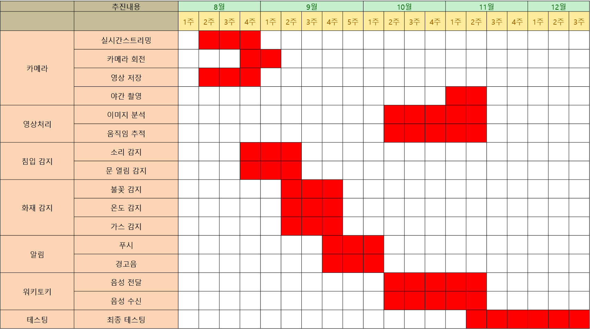
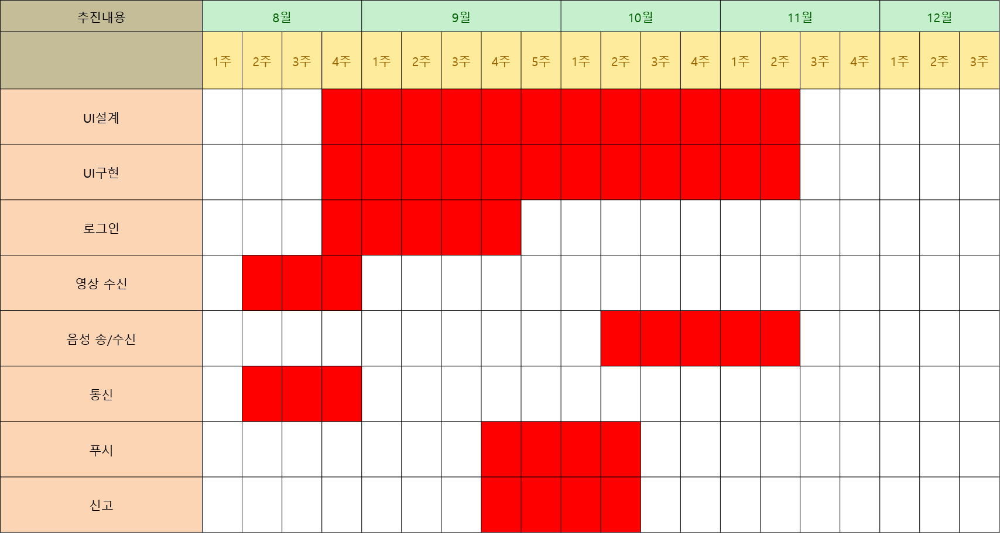

# IoT-Platform
#Graduation Project
#Smart Package
    이 프로그램은 스마트홈을 위한 가정용 IoT-Platform이다. 
    오픈소스 하드웨어(라즈베리파이, 아두이노)를 활용하며, 이를 관리하기 위한 어플리케이션을 제공한다.
    
###기능
	양방향 워키토키  
	실시간 모니터링 
	상하좌우 회전 카메라 
	야간 모니터링  
	침입감지 알림 
	캡처 / 간편녹화 
	경보음 / 긴급통화  
	가스차단   
	전력차단 
	문열림감지  
	화재감지 
	사용자 알림(푸시) 
	얼굴인식 
	움직임 추적  
	소리 감지 
	모드 설정(재택/외출)  
	
#MileStone

###1. milestone of development
  
  
